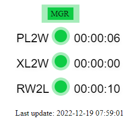

# Linux_GoldenGate_Monitoring
Classic Golden Gate monitoring with bash script

    

## For run script
 - copy all file to your server
 - edit **gg_monitoring.sh** and set `GG_HOME` and `TOMCAT_PATH`
 - `chmod +x gg_monitoring.sh`
 - `crontab -e`
 - add `*/15  * * * * /<FILE_LOCATION>/gg_monitoring.sh`
